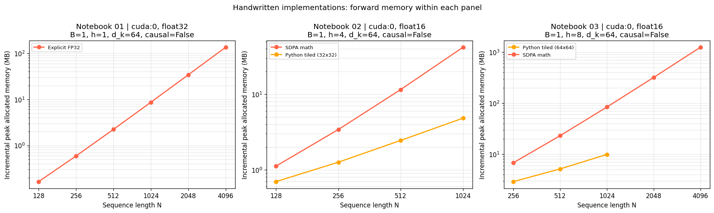

# Efficient Attention Lab

**注意力机制的分块计算与反向传播实验**

本项目围绕注意力计算中的显存占用问题，参考 Online Softmax 和 FlashAttention 完成公式推导与 PyTorch 实现。主要工作是把注意力计算分成小块，保证分块前后的输出一致，并在反向传播时重新计算所需权重，减少需要保存的中间数据。实验通过输出比较、梯度检查和显存测量，验证这些方法的实现结果。

实验按照“标准注意力 → 分块计算 → 重计算反向 → INT8 量化 → 结果分析”的顺序展开。代码主要使用 Python 和 PyTorch，GPU 运算由 PyTorch 完成；另外测量 PyTorch 内置注意力实现的速度，作为对照。

技术栈：**Python、PyTorch、NumPy、pandas、Matplotlib、Jupyter Notebook**。五份 notebook 均保留执行输出，可直接查看；完整分析见 [05 实验报告](notebooks/05_results_analysis.ipynb)。

## 目录

- [实验内容与结果](#实验内容与结果)
- [代表性实验结果](#代表性实验结果)
- [项目结构](#项目结构)
- [环境与运行](#环境与运行)
- [实验范围与后续工作](#实验范围与后续工作)
- [参考资料](#参考资料)

## 实验内容与结果

| Notebook | 主要内容 | 实验结果 |
| --- | --- | --- |
| [01 标准注意力](notebooks/01_standard_attention.ipynb) | 编写缩放点积注意力、因果掩码和多头注意力，分析计算量与显存占用 | 与 PyTorch 注意力接口 SDPA 比较，最大绝对误差约 **1.25e-06**；多头注意力在相同权重下的误差约 **1.04e-07**；长序列下显存占用接近平方增长 |
| [02 Online Softmax](notebooks/02_online_softmax.ipynb) | 推导逐块更新 softmax 的方法，实现分块前向计算，处理最后一个不完整的数据块和因果掩码 | **10 项前向检查和 5 项精度检查通过**，前向检查最大绝对误差约 **6.26e-07**；所列配置的新增显存峰值由 math 的 **41.948 降至 4.820 MB** |
| [03 FlashAttention](notebooks/03_flash_attention.ipynb) | 参考 v1 / v2 实现分块前向；推导并编写重计算反向，分析数据读写和反向需要保存的内容 | 普通与因果模式的输出、梯度检查通过，$dQ,dK,dV$ 的最大绝对误差约 **1.13e-06**；分析了保存完整权重与保存输出、行统计量的空间差别 |
| [04 INT8 量化](notebooks/04_int8_quantization.ipynb) | 作为扩展实验，比较量化位数、分组方式、异常值和校准方法；测试 CPU 动态 INT8，完成梯度近似与小型量化训练示例 | 四个投影层的权重数据约 **4.00× 压缩**；CPU 整层加速比为 **0.96–1.10×**；小型量化感知训练（QAT）的均方误差从 **9.63e-02 降至 1.08e-04** |
| [05 结果分析](notebooks/05_results_analysis.ipynb) | 汇总输出、梯度、显存和量化结果，说明哪些数据来自实际测量、哪些来自公式估算 | 整理 **72 条性能记录（70 成功、2 跳过）**，导出 **4 份 CSV、7 张分析图**，保留实验设置和测量方法 |

表中的误差来自各 notebook 保存的检查结果，只对应实验中测试过的输入。分块前向、重计算反向和量化模拟由项目代码实现，Flash 和 CPU 动态 INT8 通过 PyTorch 接口调用。MHA 表示多头注意力，SDPA 是 PyTorch 的缩放点积注意力接口。

## 代表性实验结果

### 分块计算与梯度检查

**分块计算需要使用整行的 softmax 分母。** 如果各块分别做 softmax 再拼接，结果就会改变。02 在计算过程中记录每行最大值 $m$、指数和 $\ell$ 与输出 $O$。读入新块后，如果最大值发生变化，就同时调整之前的分母和输出分子。这样可以逐块计算，最终得到与完整注意力一致的结果。

**重计算反向是在反向传播时重新计算所需的中间结果。** 03 保留前向输出和每行的统计量，反向时重新算出当前块的注意力权重，再按块计算并累加 $Q,K,V$ 的梯度。因此，不需要一直保存完整注意力权重和对应的中间梯度矩阵。05 说明关键公式，完整推导和代码见 02、03。

02 在序列长度 `N=65` 下测试了五组块形状及普通、因果两种模式，包含不完整的最后一块和整行被掩码遮住的局部块；FP32 最大绝对误差约 **6.26e-07**。03 在 FP32、`B=1, h=2, N=17, d_k=16`、7×5 块下，将自己计算的梯度与 PyTorch 自动求导结果比较，三组梯度的最大绝对误差约 **1.13e-06**。检查结果汇总见 [05](notebooks/05_results_analysis.ipynb)。

### 显存占用与需要保存的数据

01 在 FP32、`B=1, h=1, d_k=64` 下，序列长度为 1024、2048、4096 时，一次计算的新增显存峰值分别为 **8.651、34.079、135.266 MB**。序列变长后，完整注意力矩阵的显存占用接近平方增长。

02、03 分别将自己的分块实现与 PyTorch 的 math 实现比较。下表均使用 FP16、`B=1, d_k=64, N=1024`，采用普通注意力并关闭梯度；02 使用 4 个头和 32×32 块，03 使用 8 个头和 64×64 块。

| 实验 | math → 分块实现的新增显存峰值 | 显存比（math / 分块实现） |
| --- | --- | --- |
| 02 Online Attention | 41.948 → 4.820 MB | **8.70×** |
| 03 Flash 风格前向 | 83.895 → 9.908 MB | **8.47×** |

在这些设置下，分块实现减少了前向计算的显存占用。02 取五轮测量中最大的显存峰值，03 使用原运行的一次测量；两组头数和测量方法不同，各自与自己的 math 结果比较。



显存以 MB（$10^6$ bytes）计，统计计算中新分配的显存峰值，包括输出和临时张量，不包括调用前已有的输入和模型。原始数据见 [01](results/01_benchmark_standard_attention.json)、[02](results/02_benchmark_online_softmax.json)、[03](results/03_benchmark_flash_attention.json)；比较结果见 [汇总 CSV](results/05_comparison_ratios.csv)。

反向传播需要保存的数据另外按公式估算：完整权重 $A$ 有 $BhN^2$ 个元素；重计算方法保存输出和每行统计量，约有 $BhNd_k+BhN$ 个元素。头数和头维度固定时，前者随序列长度平方增长，后者随序列长度线性增长。03 的 [保存数据量估算图](results/03_backward_memory.png)按 FP32、单头、`d_k=64` 比较 $A$ 与 $(O,m,\ell)$，不计两种方法都需要的 $Q,K,V$；反向代码用 $\mathrm{lse}=m+\ln\ell$ 合并两个行统计量。这张图来自公式估算，实际训练的显存峰值还没有测量。

### 扩展实验：INT8 量化

04 在 CPU、`d_model=128` 下，将四个投影层的权重数据从 **262.144 降至 65.600 kB**。统计包括量化参数，不包括 PyTorch 打包权重和管理对象的额外占用。完整 MHA 在单线程、`B=1, h=4, d_k=32, N=64–512` 下的 INT8 加速比为 **0.96–1.10×**；`N=256` 的相对 L2 输出误差约 **0.0298**。

实验分别比较压缩程度、运行时间和输出误差。QDQ 是先量化、再还原为浮点数，注意力仍用 FP32 计算；CPU 动态 INT8 使用量化后的 Linear 投影层，注意力部分仍使用浮点计算。05 用 Pareto 图比较误差和速度的取舍。数据见 [量化测速](results/04_benchmark_quantization.json)、[存储统计](results/04_quantization_storage.json)和 [QAT 示例](results/04_qat_demo.json)。

### 对照实验：PyTorch 内置注意力

03 在 RTX 4060 Laptop、FP16、`B=1, h=8, d_k=64, N=4096` 下，测量普通注意力前向计算：

| SDPA 计算方式 | 前向用时 | 新增显存峰值 |
| --- | --- | --- |
| 强制 math | 39.018 ms | 1241.547 MB |
| 自动选择 | 2.505 ms | 4.326 MB |
| 强制 Flash | 1.993 ms | 4.326 MB |

本次测量中，强制 Flash 相对 math 的速度比为 **19.57×**，相对自动 SDPA 为 **1.26×**。这些数字比较的是 PyTorch 已有实现，用于了解实际运行效果。项目的主要工作仍是分块更新、重计算反向的推导与实现，以及输出、梯度和显存检查。自动 SDPA 在各个输入下实际选择了哪种实现没有记录，精确速度比还需要重复测量。

## 项目结构

主要文件如下：

```text
efficient-attention-lab/
├── README.md
├── requirements.txt
├── notebooks/
│   ├── 01_standard_attention.ipynb
│   ├── 02_online_softmax.ipynb
│   ├── 03_flash_attention.ipynb
│   ├── 04_int8_quantization.ipynb
│   └── 05_results_analysis.ipynb
└── results/
    ├── 01–04 原始实验 JSON 与图表
    ├── 02_validation_online_softmax.json
    ├── 05_*.csv / 05_*.png
    ├── 05_analysis_summary.json
    └── environment.json
```

01 实现标准方法作为对照，02、03 完成主要推导和实现，04 补充量化实验，05 汇总和分析结果。可先阅读本页和 05，再按 01–04 的顺序查看代码细节。

## 环境与运行

### 已验证环境

| 项目 | 配置 |
| --- | --- |
| 系统 | Ubuntu 22.04.5 LTS / WSL2 |
| Python | 3.10.12 |
| PyTorch | 2.11.0+cu128 |
| PyTorch CUDA 构建版本 | 12.8 |
| GPU | NVIDIA GeForce RTX 4060 Laptop GPU |
| Notebook 内核 | Python (WSL FlashAttention) |

依赖版本见 [requirements.txt](requirements.txt)，环境和执行记录见 [environment.json](results/environment.json)。已保存的输出可以直接查看。重新运行 Flash 对照需要兼容的 NVIDIA GPU、驱动和支持 Flash 的 PyTorch 环境；CPU 可以运行部分实现和检查示例。

### 配置与执行

下载或克隆项目后，在 WSL2 / Linux 的项目根目录执行：

```bash
python3.10 -m venv .venv
source .venv/bin/activate
python -m pip install -r requirements.txt
python -m ipykernel install --user --name efficient-attention-flash --display-name "Python (WSL FlashAttention)"
```

通过 VS Code 的 Jupyter 扩展打开 notebook，选择 **Python (WSL FlashAttention)**，按 **01 → 02 → 03 → 04 → 05** 执行。本机已有环境可直接选择现有内核。

单独重跑 05 时，请保留 `notebooks/` 与 `results/` 的相对位置，以及 [分析摘要](results/05_analysis_summary.json)中 `analysis_inputs` 列出的 10 个 JSON。重新执行会更新对应结果、图表与汇总。

## 实验范围与后续工作

目前的正确性检查只覆盖实验中测试过的输入和精度。03 用独立函数计算反向梯度，并与自动求导结果比较，还没有接入完整训练流程。数据读写量和反向保存数据量来自理论估算；普通 PyTorch 分块代码如果直接使用自动求导，仍可能保存较多中间数据。

Python 实现使用较多循环和张量操作，中间计算采用 FP32，主要用于检查更新公式和梯度公式，运行速度受到实现方式限制。例如 `N=1024` 时，02 / 03 的用时分别约 **4016.920 / 170.194 ms**，对应 math 为 **29.942 / 1.451 ms**。02 做了五轮复测，每轮平均用时在 **2.43–5.71 秒**之间；其他性能数据沿用原运行。具体结果见 05，各项操作的耗时还需要用性能分析工具检查。

量化实验使用随机张量和小型 MHA / 线性层示例。输出误差和小型 QAT 的训练损失可以帮助观察量化效果，实际模型的任务准确率仍需要单独测试。

后续计划：

- 增加块形状、序列长度、掩码和输入精度的测试，进一步检查输出与梯度。
- 将自己编写的反向函数接入训练，测量前向和反向的实际显存占用。
- 对 01、03、04 进行多轮测速，检查运行时间的波动。
- 在训练好的模型和独立数据集上测试量化效果，并分析各项操作的耗时。

## 参考资料

- [Online normalizer calculation for softmax](https://arxiv.org/abs/1805.02867)
- [FlashAttention: Fast and Memory-Efficient Exact Attention with IO-Awareness](https://arxiv.org/abs/2205.14135)
- [FlashAttention-2: Faster Attention with Better Parallelism and Work Partitioning](https://arxiv.org/abs/2307.08691)
- [PyTorch 2.11 SDPA 接口](https://docs.pytorch.org/docs/2.11/generated/torch.nn.functional.scaled_dot_product_attention.html)
